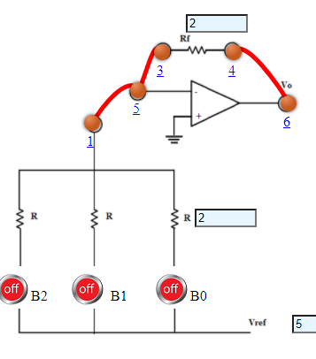

## Procedure

- **3 bit Binary Weighted Resistors**
1. Connect the components as mentioned below:
L1-L5, L4-L6, L3-L5.(For eg. click on 1 and then drag to 5 and so on.)
2. Click on 'Check Connection' button to check the connections.
3. If connected wrong, click on the wrong connection. Else click on 'Delete all connection' button to erase all the connections.
4. Set the Resistance (R) value (1 Kohm - 10 Kohm).
5. Set the Feedback Resistance (Rf) value same as the Resistance (R) .
6. Set input voltage (Vin).
7. The IC is given proper bias of +12V and -12V to VCC and VEE respectively.
8. Intially B2B1B0 are set to 000.(B2B1B0 are 3 bit input)
9. Now note the output voltage and click on 'Add to table' button.
10. Change the B2B1B0 and note the output voltage and click on 'Add to table' button.
11. Repeat the experiment for another set of resistance value.

3 bit Binary Weighted Resistors

- **4 bit Binary Weighted Resistors**
1. Connect the components as mentioned below:
L1-L5, L4-L6, L3-L5.(For eg. click on 1 and then drag to 5 and so on.)
2. Click on 'Check Connection' button to check the connections.
3. If connected wrong, click on the wrong connection. Else click on 'Delete all connection' button to erase all the connections.
4. Set the Resistance (R) value (1 Kohm - 10 Kohm).
5. Set the Feedback Resistance (Rf) value same as the Resistance (R) .
6. Set input voltage (Vin).
7. The IC is given proper bias of +12V and -12V to VCC and VEE respectively.
8. Intially B3B2B1B0 are set to 0000.(B3B2B1B0 are 4 bit input)
9. Now note the output voltage and click on 'Add to table' button.
10. Change the B3B2B1B0 and note the output voltage and click on 'Add to table' button.
11. Repeat the experiment for another set of resistance value.

4 bit Binary Weighted Resistors

- **4 bit Binary Ladder**
1. Connect the components as mentioned below:
L1-L5, L4-L6, L3-L5, L9-L12.(For eg. click on 1 and then drag to 5 and so on.)
2. Click on 'Check Connection' button to check the connections.
3. If connected wrong, click on the wrong connection. Else click on 'Delete all connection' button to erase all the connections.
4. Set the Resistance (R) value (1 Kohm - 10 Kohm).
5. Set the Feedback Resistance (Rf) value same as the Resistance (R) .
6. Set input voltage (Vin).
7. The IC is given proper bias of +12V and -12V to VCC and VEE respectively.
8. Intially B3B2B1B0 are set to 0000.(B3B2B1B0 are 4 bit input)
9. . Now note the output voltage and click on 'Add to table' button.
10. Change the B3B2B1B0 and note the output voltage and click on 'Add to table' button.
11. Repeat the experiment for another set of resistance value.

4 bit Binary Ladder

