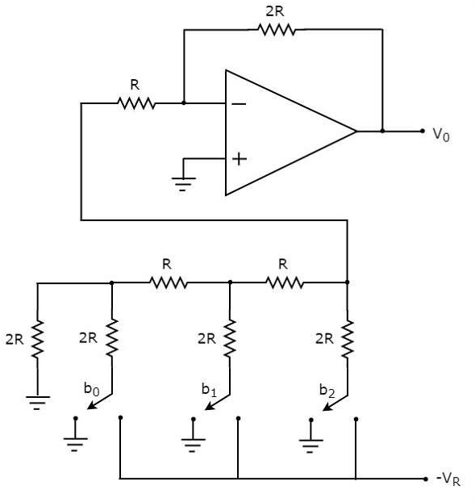

## Theory 

A Digital to Analog Converter (DAC) converts a digital input signal into an analog output signal. The digital signal is represented with a binary code, which is a combination of bits 0 and 1. The block diagram of DAC is shown in the following figure −

Figure 1

A Digital to Analog Converter (DAC) consists of a number of binary inputs and a single output. In general, the number of binary inputs of a DAC will be a power of two.

#### Types of DACs
There are two types of DACs
1. Weighted Resistor DAC
2. R-2R Ladder DAC

#### Weighted Resistor DAC

A weighted resistor DAC produces an analog output, which is almost equal to the digital (binary) input by using binary weighted resistors in the inverting adder circuit. In short, a binary weighted resistor DAC is called as weighted resistor DAC. The circuit diagram of a 3-bit binary weighted resistor DAC is shown in the following figure -

Figure 2

The bits of a binary number can have only one of the two values. i.e., either 0 or 1. Let the 3-bit binary input is b2b1b0. Here, the bits b2 and b0 denote the Most Significant Bit (MSB) and Least Significant Bit (LSB) respectively. The digital switches shown in the above figure will be connected to ground, when the corresponding input bits are equal to ‘0’. Similarly, the digital switches shown in the above figure will be connected to the negative reference voltage, −VR when the corresponding input bits are equal to ‘1’. In the above circuit, the non-inverting input terminal of an op-amp is connected to ground. That means zero volts is applied at the non-inverting input terminal of op-amp. According to the virtual short concept, the voltage at the inverting input terminal of opamp is same as that of the voltage present at its non-inverting input terminal. So, the voltage at the inverting input terminal’s node will be zero volts. The nodal equation at the inverting input terminal’s node is:

 $$ \frac{0+V_Rb_2}{2^0R} + \frac{0+V_Rb_1}{2^1R}+\frac{0+V_Rb_0}{2^2R}+\frac{0-V_o}{R_f}=0 $$
$$ \frac{V_o}{R_f}= \frac{V_Rb_2}{2^0R}+\frac{V_Rb_1}{2^1R}+\frac{V_Rb_0}{2^2R}$$
$$ V_o= \frac{V_RR_f}{R}(\frac{b_2}{2^0}+\frac{b_1}{2^1}+\frac{b_0}{2^2})$$

The above equation represents the output voltage equation of a 3-bit binary weighted resistor DAC. Since the number of bits are three in the binary (digital) input, we will get seven possible values of output voltage by varying the binary input from 000 to 111 for a fixed reference voltage, VR. We can write the generalized output voltage equation of an N-bit binary weighted resistor DAC as shown below based on the output voltage equation of a 3-bit binary weighted resistor DAC.

$$ V_o=\frac{V_R}{2}(\frac{b_{N-1}}{2^0}+\frac{b_{N-2}}{2^1}+....+\frac{b_0}{2^{N-1}}) $$ 

#### R-2R Ladder DAC

The R-2R Ladder DAC overcomes the disadvantages of a binary weighted resistor DAC. As the name suggests, R-2R Ladder DAC produces an analog output, which is almost equal to the digital (binary) input by using a R-2R ladder network in the inverting adder circuit. The circuit diagram of a 3-bit R-2R Ladder DAC is shown in the following figure −

Figure 3

The bits of a binary number can have only one of the two values. i.e., either 0 or 1. Let the 3-bit binary input is b2b1b0. Here, the bits b2 and b0 denote the Most Significant Bit (MSB) and Least Significant Bit (LSB) respectively. The digital switches shown in the above figure will be connected to ground, when the corresponding input bits are equal to ‘0’. Similarly, the digital switches shown in above figure will be connected to the negative reference voltage, −VR when the corresponding input bits are equal to ‘1’. It is difficult to get the generalized output voltage equation of a R-2R Ladder DAC. But, we can find the analog output voltage values of R-2R Ladder DAC for individual binary input combinations easily.

